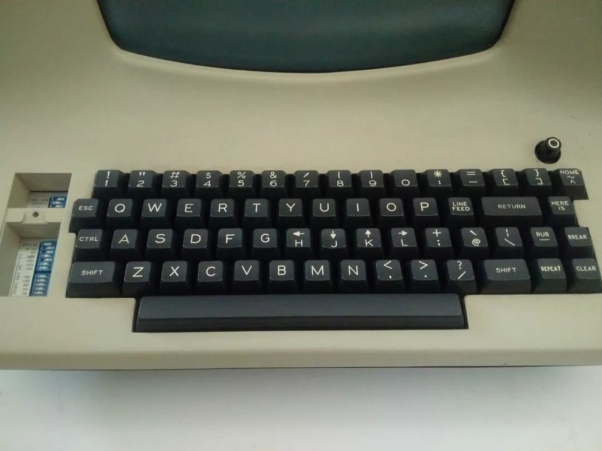

# Part 1 -- Basic Operation

This file gives a guideline for the vim workshop part 2.

---

## Menu

- [Part 1 -- Basic Operation](#part-1----basic-operation)
  - [Menu](#menu)
  - [Before Start](#before-start)
  - [Mode Intro](#mode-intro)
  - [Normal Mode](#normal-mode)
  - [Why key in vim is so uncomfortable?](#why-key-in-vim-is-so-uncomfortable)
  - [Insert Mode](#insert-mode)
  - [Life Hack](#life-hack)
  - [Visual Mode](#visual-mode)
  - [Replace Mode\*](#replace-mode)
  - [Command Mode](#command-mode)

---

## Before Start

Before we start to learn vim's basic operation, there are several things to mention:

1. Use `:help`

   You can use the command in the vim just like what you've done in the matlab

2. Vimtutor

   You can type vimtuor in your terminal to start the vimtutor, a Chinese tutor for vim. It only takes you about 25~30 min. If you feel just give it a try if you want to go over the basic command of vim.

3. Official Website

    Community is an important part of editor. There are a lot of good quality resource made by the developers and experienced vimers on the official website. You can join the community or search on the official website to get supported.

4. Vim Adventure

    Vim adventure is a great game intended to help beginners to learn the vim with fun. Since it is non-free, you can pay for the rest of the game or find a reverse engineered version.

5. [Openvim](https://openvim.com)

6. [Cheatsheet](https://devhints.io/vim)

---

## Mode Intro

1. Normal Mode
2. Insert Mode
3. Visual Mode
4. Replace Mode*
5. Command Mode

## Normal Mode

1. Navigating
   1. Basic: hjkl

      You can use `hjkl` to replace the direction key on your key board.

      `h` for $\leftarrow$, `j` for $\downarrow$, `k` for $\uparrow$, `l` for $\rightarrow$

   2. Word: bwe

      You can use the wbe to jump word by word.

      Difference between `word` and `WORD`: The `word` is the combination of (a-zA-Z0-9), or the combination of punctuation and character like `@#$%` while the WORD is any non-empty string between the white-space.

      NOTE THAT `as213df%#^>?^&` is two `word`, `as213df` and `%#^>?^&`.

      - `w`: go to the beginning of next word
      - `b`: go to the beginning of previous word
      - `e`: go to the end of the word
      - `W`: go to the  beginning of next WORD
      - `B`: go to the beginning of previous WORD
      - `E`: end of the WORD

   3. Line: 0, ^, $

      - `0`: Go to the beginning of line
      - `^`: Go to the beginning of line (after whitespace)
      - `$`: Go to the end of line

   4. Char:

      - `f{char}`: Go forward to character
      - `F{char}`: Go backward to character

   5. Document

      - `gg`: First line
      - `G`: Last line
      - `:{number}`: Go to line {number}
      - `{number}G`: Go to line {number}
      - `{number}j`: Go down {number} lines
      - `{number}k`: Go up {number} lines

   6. Window

      - `zz`: Center this line
      - `zt`: Top this line
      - `zb`: Bottom this line
      - `H`: Move to top of screen
      - `M`: Move to middle of screen
      - `L`: Move to bottom of screen

2. Clipboard:
   1. `x`: Delete the character
   2. `dd`: Cut the line
   3. `yy`: Yank line
   4. `p`: Paste
   5. `P`: Paste before
   6. `"*p / "+p:` Paste from system clipboard
   7. `"*y / "+y`: Paste to system clipboard

3. Opeartors

   >Operators let you operate in a range of text (defined by motion). These are performed in normal mode.

   For Example:

   |Operator|Motion|
   |---|---|
   |d|w|

- Text Objects

   |key|Object|
   |---|---|
   |p|Paragraph|
   |w|Word|
   |s|Sentence|
   |[ ( { < A [], (), or {}|block|
   |' " `|A quoted string|
   |b|A block (|
   |B|A block in {|
   |t|A XML tag block|

- Sentence and Paragraph in vim

- Command

   |`dl`|delete character (alias: "x")
   |---|---|
   |`dw`|delete next word|
   |`dW`|delete next WORD|
   |`diw`|delete inner word|
   |`daw`|delete a word|
   |`diW`|delete inner WORD|
   |`daW`|delete a WORD|
   |`db`|delete to beginning of the word|
   |`dgn`|delete the next search pattern match|
   |`dd`|delete one line(actually cut one line)|
   |`dis`|delete inner sentence|
   |`das`|delete a sentence|
   |`dib`|delete inner '(' ')' block|
   |`dab`|delete a '(' ')' block|
   |`dip`|delete inner paragraph|
   |`dap`|delete a paragraph|
   |`diB`|delete inner '{' '}' block|
   |`daB`|delete a '{' '}' block|

   For more combinations, use `:help motion.txt`

   You can repeat the command by assigning a number.

   For example: 3dd means delete three lines.Times of repetition should be the multiplication of the numbers. Eg. 2y3y means yank 6 lines.

## Why key in vim is so uncomfortable?



## Insert Mode

1. Open Insert Mode:
   1. `a`: append
   2. `i`: insert
   3. `o`: insert in next line
   4. `A`: append at the end of the line
   5. `I`: insert text before the first non-blank in the line
   6. `O`: insert in previous line
   7. `s`: delete char and insert
   8. `S`: delete line and insert
   9. `C`: delete until the end of the line and insert

2. Exit Insert Mode
   1. Press \<Esc\>: exit insert mode
   2. ctrl c: exit insert mode and abort current command

## Life Hack

- Use `,` to repeat previous edit
- Use `:!` to run command in terminal
- Use `:r` to insert the file below the cursor
- Vim Macro

   You can use vim macro to complete the repetition work.

   1. Enter `q\<char\>` to start recording the macro.
   2. Edit one line
   3. Enter `q` to stop recording
   4. Move to the line you modify(You can include this step in recording the macro)
   5. Enter `@\<char\>`

## Visual Mode

1. Visual Mode

   Start Visual mode per character.

2. Visual Line Mode

   Start Visual mode linewise.

3. Visual Block Mode

   Start Visual mode blockwise.

4. Use `gu` and `gU`.

5. Use `>` and `<`

6. d, y, c, o in the visual mode

## Replace Mode*

You can use `r` to replace a character.

You can use `R` to enter the replace mode.

## Command Mode

1. Exiting Vim:
   1. `:q`: quit the file
   2. `:qa`: quit all the file
   3. `:w`: Write(Save the file)
   4. `:wq`: Write and quit the file
   5. `:x`: Write and quit the file(only write when there is change).
   6. `ZZ`: Save and quit（the same to :x)
   7. `ZQ`: Quit without checking changes
   8. `!`: You can add a `!` at the end of the command to do the command by force. For example to quit the file by force, you can use `:q!`

2. Call the terminal

   You can call the terminal by using the command `:term`. You can also use term to run command like compiling a c-file. For example:

   ```vim
   :term gcc vim.c
   :term ./a.out
   ```

   You can also open a terminal window in the vim using the command; `:term`

   You can use command to determine the position of the terminal. For example:

   ```vim
   :belowright term ++rows=10
   ```

   If you want to enter the terminal for a while and then go back to vim, you can use the following code

   ```vim
   <C-z> "suspend to vim and go to the terminal
   ```

   ```zsh
   fg #go back to vim
   ```

   You can also determine which terminal you use with the command

   ```vim
   :term {terminal you want to use}

   " for example
   :term python3
   ```

3. Run Vim command

   Believe it or not, vim has its own language. You can use the command of vim to personalize your vim. This part will be included in the `Modify .vimrc(noplugin)`

4. Split the window

   `:vs` or `:vsplit`: split the window vertically

   `:vs filename`: split the current window vertically, show the new file in the new window.

   `:sp or :split`: split current window horizontally.

   `:sp filename`: split current window horizontally and show the new file in the new window

   `:new`: create new file and split the window horizontally

   `:vnew`: create new file and split the window vertically

- Search

   You can use search the string by entering `/` and `?`

   Difference between `/` and `?`:  
   `/` means search from top to bottom,  
   `?` means search from bottom to top.

   If you want to search for exactly the `word`(`WORD`?), you can search in this way: /\\<{word you want to search}\\> or ?\\<{word you want to search}\\>

   For example, you can use /\\<hello\\> to search the word `hello` from top to bottom

  - `n`: Search for the next pattern
  - `N`: Previous match
  - `*`: Next whole word under cursor
  - `#`: Previous whole word under cursor

   Vim will record your search history. You use command like /$\uparrow$ or /$\downarrow$ if you want to search the word you searched before.

   You can also replace all the results fit the expression you search by command:

   ```vim
   {range}s/{search}/{replace}/{flags} {count}
   ```

   You can use \\<{word}\\> to search for the "word"

  - range is the searching range, You can define the range in following way:

      ```vim
      {start},{end}
      ```

      There are some characters have special meaning when defining the range:

      `%` stands for all the lines in the file

      `.` stands for the current line

      `$` stand for the last line in the file

      If range is not set, subtitute will only happens on the current line.

  - `s` stands for substitute

  - Commonly used flags
    - `g`: Replace all occurrences in the line. Without this argument, replacement occurs only for the first occurrence in each line.
    - `i`: Ignore case for the pattern.
    - `I`: Don't ignore case for the pattern.
    - `n`: Report the number of matches, do not actually substitute.

   Example:

   ```vim
   "replace all int with double
   :%s/int/double/g

   "replace first int in each line with double
   :%s/int/double/

   "replace all int in line1-line3 with double
   :1,3s/int/double/g

   "replace all int from current line to the next 4 line with double
   :.,.+4s/int/double/g

   "do :%s/int/double/g for 4 times(from current line to current+3 line)
   :%s/int/double/g4
   ```

   For more information, you can type `:help substitute` in vim.

  - Regex in Search

   The behavior of regex in vim can be determined by setting the magic.

   |Mode|Behavior|
   |---|---|
   |magic \m|^，$，.，*,[] has special meaning|
   |nomagic \M|^,$,\ has special meaning|
   |verymagic \v|all character has special meaning|
   |verynomagic \V|no character has special meaning except \ |

   Example:

   ```vim
   :%s/\vmagics?/abstract/g
   ```
